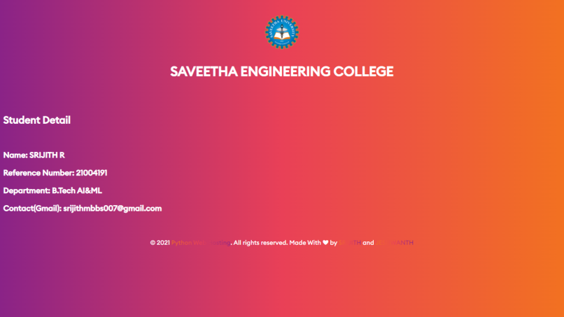

# Developing a Simple Webserver
## AIM:

To develop a simple webserver to serve html pages.
## DESIGN STEPS:
### Step 1:

HTML content creation
### Step 2:


Design of webserver workflow
### Step 3:

Implementation using Python code
### Step 4:

Serving the HTML pages.
### Step 5:

Testing the webserver
## PROGRAM:
```
from http.server import HTTPServer, BaseHTTPRequestHandler
content = """
<!DOCTYPE html>
<html>
<head>
<title>Saveetha Engineering College</title>
<link rel = "icon" href = 
"https://media.discordapp.net/attachments/533340656987275284/906080541344956436/kissclipart-saveetha-university-chennai-logo-clipart-saveetha-3a90c06681798db2.png" 
        type = "image/x-icon">
</head>
<body>

<br><center><h1>SAVEETHA ENGINEERING COLLEGE</center></h1></br>
<br><h2>Student Detail</h2></br>
<h3>Name: SRIJITH R</h1>
<h3>Reference Number: 21004191</h3>
<h3>Department: B.Tech AI&ML</h6>
<h3>Contact(Gmail): srijithmbbs007@gmail.com</h3>
<center><br><br><div class="footer">
        <div class="container">
          <div class="row">
            <div class="col-md-12">
              <div class="copyright-text">
                <p>
                  © 2021
                  <a href=""
                    ><u>Python Web Hosting</u></a
                  >. All rights reserved. Made With ❤ by
                  <a href=""><u>SRIJITH</u></a> and 
                  <a
                    href=""
                    ><u>JESHWANTH</u></a
                  >
                </p>
              </div>
            </div>
          </div>
        </div>
      </div></br></br></center>

</body>
  <style>
    @font-face {
      font-family: "Euclid Circular B Medium";
      src: url("//db.onlinewebfonts.com/t/721c73bcd2e49f3a621991089838b503.eot");
      src: url("//db.onlinewebfonts.com/t/721c73bcd2e49f3a621991089838b503.eot?#iefix")
          format("embedded-opentype"),
        url("//db.onlinewebfonts.com/t/721c73bcd2e49f3a621991089838b503.woff2")
          format("woff2"),
        url("//db.onlinewebfonts.com/t/721c73bcd2e49f3a621991089838b503.woff")
          format("woff"),
        url("//db.onlinewebfonts.com/t/721c73bcd2e49f3a621991089838b503.ttf")
          format("truetype"),
        url("//db.onlinewebfonts.com/t/721c73bcd2e49f3a621991089838b503.svg#Euclid Circular B Medium")
          format("svg");
    }

    body {
      background: linear-gradient(to right, #8a2387, #e94057, #f27121);
      color: #fff;
      font-family: "Euclid Circular B Medium", Poppins;
    }
     <style>
  <script>
    .footer {
      padding: 32px 0;
      position: absolute;
      width: 100%;
      background-color: red;
      color: white;
      text-align: center;
      background: rgba(255, 255, 255, 0.5);
      box-shadow: 0 8px 32px 0 rgba(31, 38, 135, 0.37);
      backdrop-filter: blur(9px);
      -webkit-backdrop-filter: blur(9px);
      border: 1px solid rgba(255, 255, 255, 0.18);
    }

    .footer p {
      margin: 0;
      line-height: 26px;
      font-size: 15px;
      color: #fff;
    }

    .footer p a {
      background: linear-gradient(to right, #f27121, #e94057, #8a2387);
      color: transparent;
      -webkit-background-clip: text;
      background-clip: text;
      text-decoration: none;
    }

    .footer p a:hover {
      color: white;
    }
  </style>
  <script>

</html>
"""
class myhandler(BaseHTTPRequestHandler):
    def do_GET(self):
        print("request received")
        self.send_response(200)
        self.send_header('content-type', 'text/html; charset=utf-8')
        self.end_headers()
        self.wfile.write(content.encode())
server_address = ('',2004)
httpd = HTTPServer(server_address,myhandler)
print("Website is running...")
httpd.serve_forever()

```
## OUTPUT:


## RESULT:
A WebServer Has Been Created Successfully!